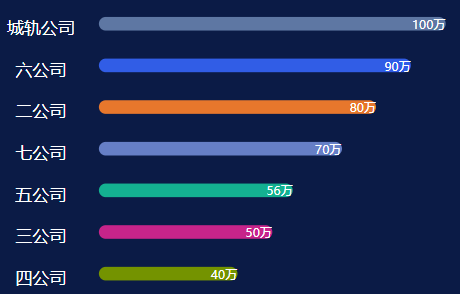

## 排名或者进度条组件

> 排名的名称以及数值，随机颜色，传过来的数据最好是经过排序的，因为组件没有给数据排序。

只需要传一个数据类型为`Array`的`rankingData`参数
eg:
```
rankingData:[{
    name: "默认的名称",
    value: "默认的数值",
    type: "有type默认百分比。没有type单位是万"
}]
```
效果图如下:


